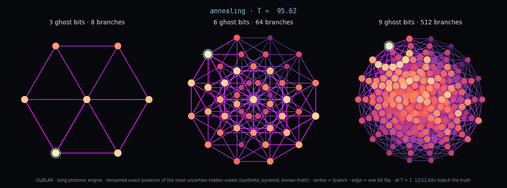
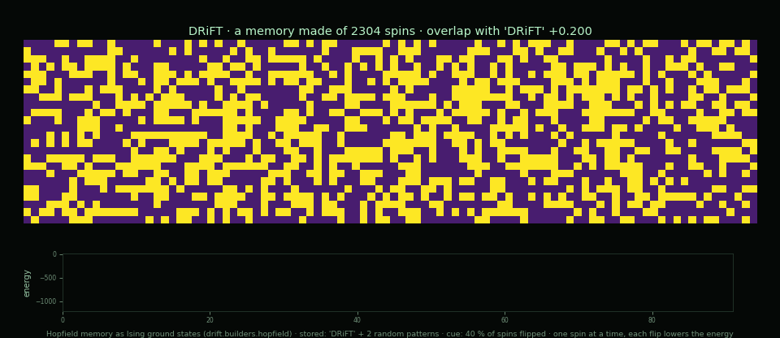
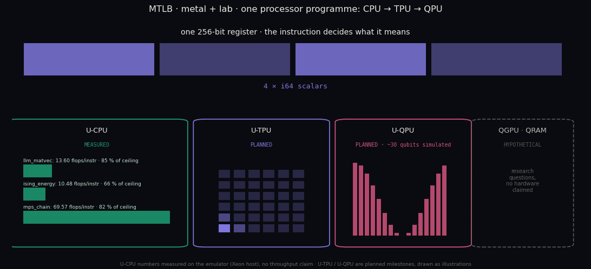

### 1 · [QuBLAR](https://github.com/QuantumDrizzy/QuBLAR) — an Ising photonic engine: *bits are dimensions, not pixels*

  

Quantum-inspired, **no qubits**. A hidden structure is imaged from how much of a signal gets through
it (muon tomography of a synthetic pyramid, known truth). Every voxel is a bit, the reconstruction is a
QUBO, and annealing to T = 1 *samples the posterior*: each run is a branch, and the map comes out
three-state — *exists*, *does not exist*, *undecided*. A rerun with the prior switched off tells what
came from the data and what came from the assumptions.

At 2^27 muons the classical baseline (MLEM) puts the void **30 m off**; the Ising engine finds 11
voxels, **all 11 correct, centroid 0.1 m from the truth, zero false voids**. The film is the 12 voxels
the branches disagreed on most: their exact 2^12 posterior, cooled from T ≈ 96 to 1, drawn as the 3-,
6- and 9-cube of branches (vertex = branch, edge = one bit flip). At T = 1, **12/12 bits match the
truth** — the disagreement was sampling, not evidence. The baseline's own failure (an apex artifact) is
filed as a known limit, not tuned away.

### 2 · [DRiFT](https://github.com/QuantumDrizzy/DRiFT) — computronium: *matter that computes by relaxing*

  

Optimization, self-assembly and neural memory read as ground states of *one* Ising Hamiltonian. Here,
a memory made of nothing but 2304 spins: the word is stored as a ground state, the cue has 40 % of its
spins flipped, and the system remembers by going downhill — one spin at a time, every flip lowering
the energy. **Overlap 0.200 → 1.000, energy −46 → −1152, monotone.** Storing three words instead fell
into a *spurious mixture* (overlap 0.848) — the classic Hopfield failure, measured and kept on record.

How far is real hardware from the physical floor of computation? **Six orders of magnitude above the
Landauer wall** — that gap is the headroom unconventional substrates are competing for.

### 3 · [MTLB](https://github.com/QuantumDrizzy/MTLB) — metal + lab: *one processor programme, CPU → TPU → QPU*

  

A 256-bit instruction set, a cycle-accurate emulator, an assembler and an object format — Rust,
**zero dependencies** — built to answer one question honestly: *what does this work actually cost the
machine?* The CPU rung is **measured** on three real workloads (int8 matvec at a 7B's hidden size,
Ising coupling energy, a 256-site MPS contraction). The tensor and quantum rungs are **planned**
milestones; QGPU and QRAM are research questions, and the figure says so.

The headline is a **negative** result: `VDOT.B` has exactly the arithmetic density of AVX2's
`VPMADDUBSW`, so 256-bit width buys nothing; only the fused `ZIPPER2` contraction is genuinely ahead.
Measurement also exposed a hole in my own design (no mixed-width int8×int64 dot, 34 % of achievable
density), documented rather than hidden. **And the number I did not publish:** dividing instruction
counts by an assumed 3 GHz would have shown this beating both CPU and GPU — but the host baselines are
~97 % dispatch overhead (an *empty* CUDA matmul costs 45.66 µs against 46.8 µs measured), so that
comparison measures Python, not silicon.

### 4 · [Blaze](https://github.com/QuantumDrizzy/Blaze) — the compressor the other engines speak through

  

Tensor-Train / MPS compression: GPU SVD over a C ABI to Rust, MPS-to-circuit bridge, int8 and 4-bit
cores with **measured** error. Bond dimension χ is the accuracy-against-cost dial the rest of the stack
turns. It compresses only what has structure — so the random control is on the card, not dropped.

| Workload | Ratio (dense / TT) | Error | Note |
|---|---:|---|---|
| Haar-random state (control) | 0.38× | — | TT is *larger* than dense: nothing to exploit |
| TFIM n = 16, critical | 19× | lossless to ~1e-7 | the hardest point of the phase diagram |
| TFIM n = 16, paramagnet | 77× | lossless to ~1e-7 | |
| paramagnet + int8 cores | 447× | fidelity 0.99994 | |
| paramagnet + 4-bit cores | 705× | quantized, error composed | |
| QuBLAR ghost bits (2^20 posterior) | 26214× | marginals to 7e-7 | TT rank 1–2: a sharp posterior |

*RTX 5060 Ti (sm_120). Numbers from each repository's own results files; nothing re-run for the card.*
